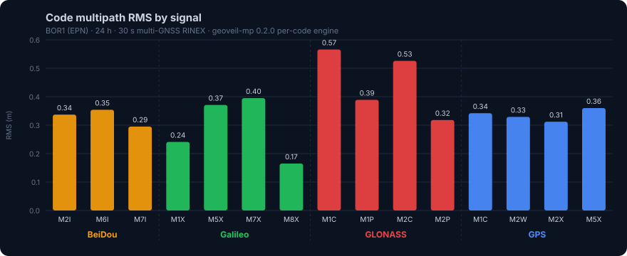
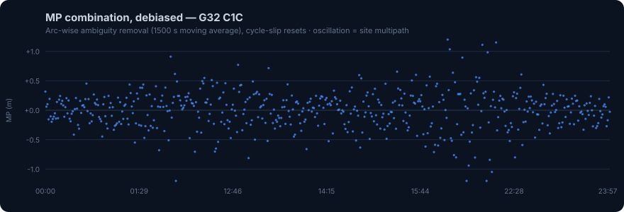
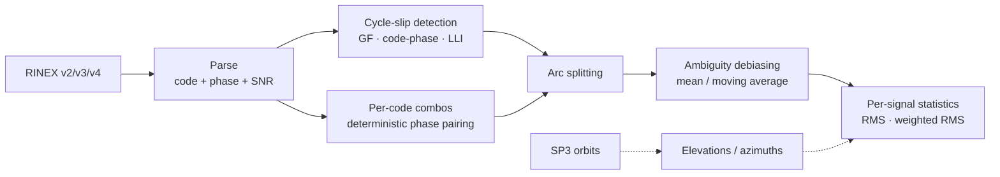

<div align="center">

# geoveil-mp

**GNSS code multipath analysis — Rust core, Python API**

[](https://crates.io/crates/geoveil-mp)
[](https://pypi.org/project/geoveil-mp/)
[](https://pypi.org/project/geoveil-mp/)
[](https://www.rust-lang.org/)
[](https://www.python.org/)
[](https://opensource.org/licenses/MIT)
[](https://github.com/miluta7/geoveil-mp/actions)



</div>

Anubis/TEQC-style code multipath estimation for **every pseudorange observable** in a RINEX file — per-code MP linear combinations, arc-wise ambiguity debiasing, interval-aware cycle-slip detection, and SNR series export. Built for continuous station monitoring on long time series of 1 s or 30 s data, following the methodology of Hunegnaw & Teferle (*Sensors* 2022).

Part of the **GeoVeil** suite together with [geoveil-cn0](https://github.com/miluta7/geoveil-cn0) (CN0 signal quality and threat detection).

**Live demo:** [batch.geoveil-rinex.eu](https://batch.geoveil-rinex.eu) — the GeoVeil batch dashboard runs this library in production: per-code MP RMS, cycle-slip counts, SNR-residual wavelet spectra, Fresnel zone maps, and long-term multipath trend monitoring on daily 30 s station data.

---

## Installation

```bash
pip install geoveil-mp
```

Pre-built wheels for Linux, Windows, and macOS — no Rust toolchain required.

```toml
# Rust
[dependencies]
geoveil_mp = "0.2"
```

---

## Quick Start

```python
import geoveil_mp as gm

obs = gm.read_rinex_obs("BOR100POL_R_20240010000_01D_30S_MO.rnx")
print(obs.num_epochs, obs.num_satellites, obs.interval)   # 2880 104 30.0

analyzer = gm.MultipathAnalyzer(obs, elevation_cutoff=10.0, systems=["G", "R", "E", "C"])
results = analyzer.analyze()

# One statistics row per signal code: GPSM1C, GPSM2W, GALM8X, GLOM1P, BDSM2I, ...
for s in sorted(results.statistics, key=lambda s: s.signal):
    print(f"{s.signal}  rms={s.rms:.3f} m  n={s.count}  slips={s.cycle_slips}")

# Cycle slips, counted per carrier-phase signal
print(results.cycle_slip_counts)          # {'GPSL1C': 210, 'GPSL2W': 168, ...}

# Attach precise elevations from SP3 (recomputes elevation-weighted RMS)
sp3 = gm.read_sp3("COD0MGXFIN_20240010000_01D_05M_ORB.SP3")
computed, failed = results.compute_elevations(sp3, obs.approx_position)

# SNR time series per satellite and S-code (for SNR-residual multipath analysis)
for series in obs.get_snr_series("G07"):
    print(series.code, len(series), series.values[:3])
```

<div align="center">

</div>

---

## What it computes

### Per-code multipath combinations

For every pseudorange code observable `P_k` (C1C, C1X, C2W, C2X, C5X, ...), the ionosphere-free, geometry-free multipath combination is formed with two carrier phases:

```
MP_k = P_k − (1 + 2/(α−1))·Φ_i + (2/(α−1))·Φ_j        α = (f_i / f_j)²
```

- `Φ_i` — phase on the code's own band; `Φ_j` — phase on a partner band chosen from a deterministic per-system priority list
- GLONASS FDMA frequencies use the per-satellite channel numbers from the RINEX header
- The phase-ambiguity bias is removed **per continuous arc**: whole-arc mean for short arcs, centered moving average (default 1500 s) for long ones
- Arcs reset at data gaps, cycle slips, and MP jumps — slips never smear into the RMS

Signals are named in the convention used by GNSS monitoring literature: `GPSM1C`, `GPSM2W`, `GLOM1P`, `GALM8X`, `BDSM2I`.

### Cycle-slip detection

Three detectors, thresholds that scale with the sampling interval (`|Δ| > base + rate·dt`):

| Method | Test | Default threshold |
|--------|------|-------------------|
| Geometry-free | ΔGF per phase code vs. reference band | 0.10 m + 0.003·dt |
| Code-phase | Δ(Φ − P) per code | 5.0 m + 0.10·dt |
| LLI | RINEX loss-of-lock flags (phase only) | — |

At 30 s sampling this detects single-cycle L1 slips (GF signature ≈ 0.29 m vs. threshold 0.19 m) — rate-based thresholds tuned for 1 s data cannot. Slips are attributed and counted per signal code (`GPSL2W`, `GLOL1C`, ...).

### SNR series export

`RinexObsData.get_snr_series(satellite, code=None)` returns per-S-code time series (unix-second timestamps, dB-Hz values) — the input for SNR-residual multipath analysis (polynomial detrending, wavelet spectra) without re-parsing the file.

---

## Results on real data

24 h of BOR1 (EPN, Poland) 30 s multi-GNSS RINEX 3, default settings:

| Constellation | Best signal | RMS | Worst signal | RMS |
|---------------|------------|-----|--------------|-----|
| Galileo | E5 AltBOC (M8X) | 0.165 m | E5b (M7X) | 0.395 m |
| GPS | L2C (M2X) | 0.312 m | L1 C/A (M1C) | 0.342 m |
| BeiDou | B2I (M7I) | 0.295 m | B3I (M6I) | 0.354 m |
| GLONASS | L2 P (M2P) | 0.318 m | L1 C/A (M1C) | 0.566 m |

The ranking (Galileo AltBOC best, GLONASS C/A worst) reproduces published station-monitoring results. Parsing the file takes ~0.4 s; the full 15-signal analysis with slip detection ~1.4 s (306 k estimates).

---

## Analyzer options

```python
gm.MultipathAnalyzer(
    obs,
    elevation_cutoff=10.0,        # degrees; applied when elevations are known
    systems=["G", "R", "E", "C"], # G R E C J S I
    bias_window_seconds=1500.0,   # moving-average window; None = whole-arc mean
    min_arc_seconds=300.0,        # drop shorter arcs
    arc_gap_factor=5.0,           # arc break at gap > factor × interval
    include_codes=["C1C", "GC5X"],# restrict codes ("C1C" any system, "GC5X" GPS only)
    exclude_codes=[],
    max_epochs=None,              # uniform decimation guard for huge files
    detect_cycle_slips=True,
    ion_delta_base=0.10, ion_delta_rate=0.003,   # GF slip threshold (m, m/s)
    cp_delta_base=5.0,   cp_delta_rate=0.10,     # code-phase slip threshold
)
```

---

## API surface

| Object | Key members |
|--------|-------------|
| `RinexObsData` | `num_epochs`, `num_satellites`, `interval`, `marker_name`, `approx_position`, `satellites()`, `observation_types(sys)`, `glonass_fcn()`, `snr_codes(sat)`, `get_snr_series(sat, code=None)` |
| `MultipathAnalyzer` | `analyze()` → `AnalysisResults` |
| `AnalysisResults` | `estimates`, `statistics`, `cycle_slips`, `cycle_slip_counts`, `total_estimates()`, `total_cycle_slips()`, `compute_elevations(sp3, receiver)` |
| `MultipathEstimate` | `satellite`, `system`, `signal` (`"C1C"`), `epoch`, `mp_value`, `elevation`, `azimuth`, `snr` |
| `MultipathStats` | `signal` (`"GPSM1C"`), `system`, `code`, `count`, `rms`, `weighted_rms`, `mean`, `std_dev`, `min`, `max`, `cycle_slips` |
| `CycleSlip` | `satellite`, `epoch`, `signal`, `system`, `magnitude`, `threshold`, `method` (`"gf"`, `"code_phase"`, `"lli"`) |
| `SnrSeries` | `satellite`, `system`, `code`, `times`, `values`, `epochs_iso()` |
| `Sp3Data` | `satellites()`, `get_position(sat, epoch)`, `num_epochs`, `interval` |
| Functions | `read_rinex_obs`, `read_rinex_obs_bytes`, `read_sp3`, `calculate_azel`, `compute_elevation`, `get_frequency`, `get_wavelength`, `version` |

Supported input: RINEX v2 / v3 / v4 observation files, SP3-c/d orbits, broadcast ephemerides (Keplerian + GLONASS RK4).

---

## Pipeline



---

## CLI

```bash
geoveil-mp analyze --obs station.rnx --sp3 orbits.sp3 --elevation 10 --output results/
geoveil-mp info --obs station.rnx
```

---

## References

- Hunegnaw, A.; Teferle, F.N. *Evaluation of the Multipath Environment Using Electromagnetic-Absorbing Materials at Continuous GNSS Stations.* Sensors 2022, 22, 3384.
- Estey, L.H.; Meertens, C.M. *TEQC: The Multi-Purpose Toolkit for GPS/GLONASS Data.* GPS Solutions 1999, 3, 42–49.
- Václavovic, P.; Douša, J. *G-Nut/Anubis: Open-Source Tool for Multi-GNSS Data Monitoring.* IAG Symposia 2016, 143.

## License

MIT — see [LICENSE](LICENSE).

## Author

**Miluta Dulea-Flueras** — [miluta.flueras@cartografie.ro](mailto:miluta.flueras@cartografie.ro)

## Citation

```bibtex
@software{geoveil_mp,
  author  = {Dulea-Flueras, Miluta},
  title   = {geoveil-mp: GNSS Code Multipath Analysis Library},
  year    = {2026},
  version = {0.2.0},
  url     = {https://github.com/miluta7/geoveil-mp},
  license = {MIT}
}
```
